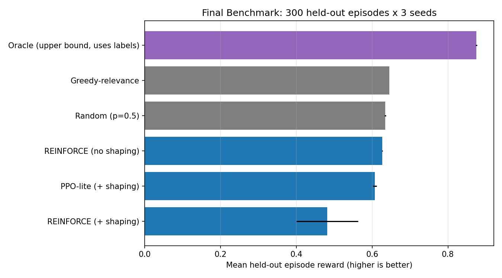
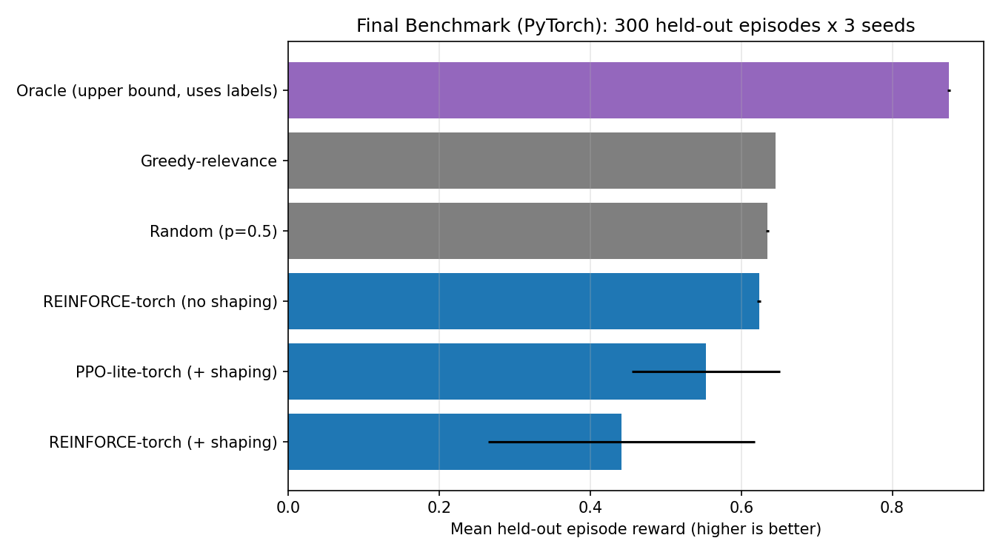

# RL for Context Selection in Agent Workflows

A small, self-contained research project built for the **RL AI Research** application, targeting the role's first bullet directly:

> *"Investigate and prototype novel RL approaches for context selection,
> reward shaping, or policy optimization in agent workflows."*

**The question this project asks:** when an agent has a ranked list of
retrieved context (documents, tool outputs, memory snippets) and a limited
context-window budget, can a learned policy decide what to keep -- balancing
task success against token cost and redundancy -- better than the heuristics
teams reach for by default (take everything above a similarity threshold,
random sampling as a floor)?

Everything in this repo actually runs -- both a from-scratch NumPy
implementation and a PyTorch port validated against it -- in well under
ten minutes combined, no GPU required. See `report.md` for the full
write-up: motivation, method, results from both implementations, and an
honest discussion of what worked, what didn't (including a training-
stability difference between the two implementations that I did not
expect and only partially explain), and why.

## What's here

```
src/context_selection/
  environment.py    MDP for sequential context selection (relevant /
                    redundant / distractor items, token-cost budget,
                    saturating coverage reward) -- shared by both
                    implementations, untouched by the PyTorch port
  policy.py         2-layer MLP Bernoulli policy, manual NumPy backprop
                    + hand-written Adam (no autograd)
  train.py          NumPy REINFORCE: moving-average baseline, entropy
                    bonus, optional reward shaping
  ppo.py            NumPy PPO-lite: clipped-surrogate trainer with
                    hand-derived sub-gradient
  policy_torch.py   The same 2-layer MLP Bernoulli policy, PyTorch
                    (nn.Linear + torch.distributions.Bernoulli),
                    gradients via torch.autograd
  train_torch.py    PyTorch REINFORCE trainer (torch.optim.Adam),
                    same algorithm/hyperparameters as train.py
  ppo_torch.py      PyTorch PPO-lite trainer, same algorithm as ppo.py
  reward.py         Potential-based reward shaping (Ng, Harada & Russell,
                    1999), with a unit test checking the theoretical
                    invariant directly rather than assuming it holds;
                    shared by both implementations
  baselines.py      Random / Greedy-relevance / Oracle reference
                    policies; shared by both implementations

experiments/
  run_benchmark.py        NumPy trainers, all 3 methods x 3 seeds,
                          writes results.csv + learning_curves.png +
                          benchmark_comparison.png
  run_benchmark_torch.py  Same benchmark, PyTorch trainers, writes
                          results_torch.csv + *_torch.png

tests/              17 unit tests: environment invariants, reward-
                    shaping's telescoping identity, a finite-difference
                    check of the hand-derived NumPy policy gradient, and
                    a direct NumPy-vs-torch.autograd gradient cross-check
                    (test_policy_torch.py) -- loads identical weights
                    into both policies and asserts the gradients match
                    to float64 precision, not just "roughly agree"

report.md           Full write-up: method, results from both
                    implementations, and an honest discussion of what
                    worked, what didn't, and a training-stability
                    difference between NumPy and PyTorch I don't fully
                    explain (Sec. 8.2)
```

## Two implementations, both actually run

This project has two independent, fully executed implementations of the
same environment, policy architecture, REINFORCE trainer, and PPO-lite
trainer:

* **NumPy, from scratch** -- forward pass, manual backprop for both the
  REINFORCE score-function estimator and the PPO clipped-surrogate
  objective, hand-written Adam. Originally built this way because the
  sandbox this project started in had no PyTorch installed and I did not
  want to hand in code that "should work" but was never run. Validated
  against finite-difference gradients (`tests/test_policy.py`).
* **PyTorch** -- same architecture and algorithms, gradients from
  `torch.autograd`, optimization from `torch.optim.Adam`. Ported once
  internet access became available. Validated two ways: a direct
  NumPy-vs-`torch.autograd` gradient cross-check on identical weights
  (`tests/test_policy_torch.py`), and a full rerun of the 3-seed
  benchmark (`experiments/run_benchmark_torch.py`) -- not assumed to
  reproduce the NumPy numbers, and it doesn't exactly: see `report.md`
  Sec. 8.2 for where the two agree closely and where they don't (the
  shaped-reward runs show meaningfully higher seed-to-seed variance in
  PyTorch, with a stated-as-hypothesis explanation, not a hand-wave).

Every number and plot in `experiments/results/` is from a real run of the
corresponding code, not a mockup.

## Running it

```bash
pip install -r requirements.txt              # numpy + matplotlib (+ torch, optional)
python -m unittest discover -s tests -v       # torch tests skip cleanly if torch isn't installed
python experiments/run_benchmark.py           # NumPy trainers, ~90s, writes experiments/results/
python experiments/run_benchmark_torch.py     # PyTorch trainers, ~3 min, requires torch
```

## Headline result (details + discussion in `report.md`)

On held-out episodes (mean over 3 seeds x 300 episodes), the learned
policies land close to a hand-tuned similarity-threshold heuristic, and a
PPO-lite variant reaches that level of performance in roughly an order of
magnitude fewer training episodes than plain REINFORCE -- a finding that
holds in **both** implementations. A ground-truth oracle shows there is
still substantial headroom (same task success at ~3x lower context-token
cost), and I did **not** find that naive coverage-only reward shaping
helped REINFORCE in this setup, in either implementation -- I report that
result honestly, with an analysis of the likely cause, rather than tuning
it away.

The PyTorch port also surfaced something I did not expect: the shaped-
reward runs are noticeably *less* stable across seeds in PyTorch than in
NumPy (REINFORCE+shaping's seed std roughly doubles). My best current
explanation is that the NumPy trainer's entropy bonus uses a hand-written
*approximate* gradient that, unlike PyTorch's exact
`torch.distributions.Bernoulli` entropy gradient, doesn't vanish as the
policy becomes confident -- so it may have been acting as an accidental
stabilizer that "doing it correctly" in PyTorch removes. Stated as a
hypothesis, not a conclusion; report.md Sec. 8.2 has the full discussion
and the controlled experiment I'd run to confirm it.




*(Repo initialized and maintained by Parisa Arbab.)*

For questions about this project, feel free to open an issue.
